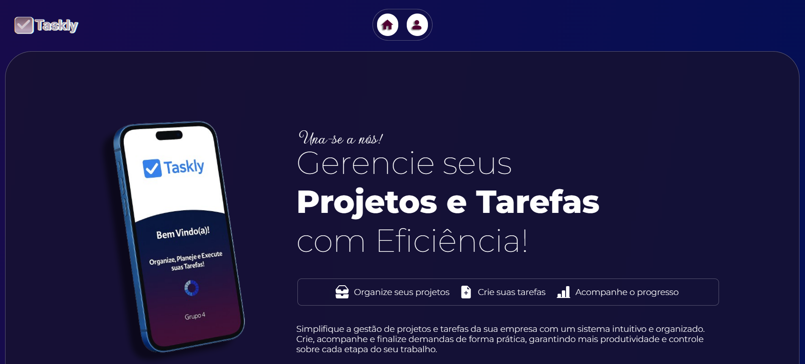

# Taskly - Sistema de Gerenciamento de Tarefas e Projetos



Taskly é uma aplicação web desenvolvida para auxiliar empresas e profissionais no gerenciamento de tarefas e organização de projetos. Com foco em usabilidade e performance, a plataforma permite visualizar o progresso de atividades de forma clara e intuitiva.

- **Criação do projeto em multiplataformas** 
  Site - HTML,CSS,JS ; Power Apps + Planilhas Google - uma versão mais 'visual/estilosa' do aplicativo ; SAP - Criação do programa usando ABAP

## ✨ Funcionalidades Principais

- **Criação e Edição de Tarefas**  
  Adicione novas tarefas com prazos, status personalizados e vincule-as diretamente aos projetos correspondentes.

- **Gestão de Projetos**  
  Organize projetos com descrições detalhadas e agrupamento de tarefas para um controle mais eficiente.

- **Status Visual Dinâmico**  
  Visualização de progresso com códigos de status e cores harmônicas integradas ao design da aplicação.

- **Controle de Prazos**  
  Seletor de datas amigável para definir e atualizar prazos das tarefas.

- **Integração com Google Sheets**  
  Leitura e escrita de dados diretamente em planilhas do Google, trazendo flexibilidade e facilidade de exportação.

- **Design Intuitivo**  
  Interface moderna.

## 🧠 Tecnologias Utilizadas

- **Frontend:**  
  `HTML`, `CSS`, `JavaScript (ES6)`

- **Integrações:**  
  `Google Sheets API` (dinamicidade dos dados)

- **Animações & UX:**  
  - Animação de entrada via scroll com JavaScript puro  
  - Sessão de parceiros com logotipos em rolagem contínua  
  - Ícones ilustrativos para cada funcionalidade

- **Script Customizado:**
  - `scroll.js` para animar elementos na tela com base no scroll do usuário

## 📂 Estrutura do Projeto

```plaintext
📂 Taskly
 ├── 📁 imgs          # Imagens gerais do projeto / capa.
 ├── 📄 index.html    # Estrutura da página inicial.
 ├── 📄 contact.html  # Estrutura da página de contato.
 ├── 📄 styles.css    # Estilização do projeto todo.
 ├── 📄 scripts.js    # Lógica da animação scroll.
 ├── 📄 README.md     # Documentação do projeto.
```

## 🚀 Como Executar

1. Clone este repositório:  
   `git clone https://github.com/seuusuario/boot-Taskly.git`

2. Abra o arquivo `index.html` no seu navegador.

> A integração com Google Sheets é feita no Power Apps e requer acesso a uma cópia da planilha ou acesso da original.

## 🛠️ Metodologia Ágil Aplicada

Durante o desenvolvimento do projeto foram utilizadas práticas da **metodologia ágil SCRUM**, como:

- **Backlog de funcionalidades**
- **Sprints diários** para desenvolvimento modular
- **Reuniões de revisão constante** (review) e refinamento
- **Anotações do progresso diariamente** para organização de tarefas e o que deveria ser feito/terminado no dia seguinte.

Essas práticas proporcionaram uma entrega mais fluida, colaborativa e orientada a melhorias contínuas.

## 📞 Página de Contato

Inclui:
- Informações institucionais
- Formulário de contato funcional
- Integração visual com o restante do app

## 🙏 Agradecimentos

Agradeço a todos os envolvidos direta ou indiretamente neste projeto, em especial aos professores e colegas de bootcamp. Este projeto é resultado de dedicação, aprendizado e paixão por tecnologia.

---

**Desenvolvido por [Caio Balduino](https://www.linkedin.com/in/caiobalduino/)** 🚀
